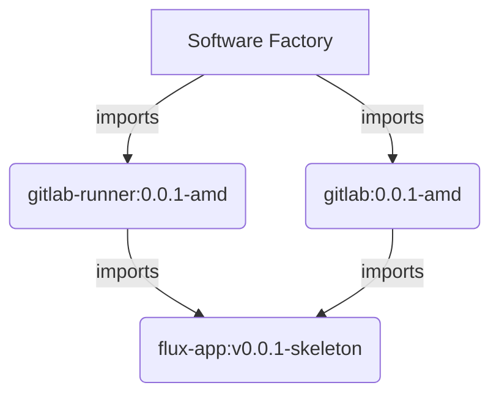

# zarf-package-podinfo

This sample repo shows how we might build a repeatable software factory using a Zarf skeleton has a repeatable
structure for each package.  Both [Gitlab](./gitlab/) and [Gitlab Runners](./gitlab-runner/) use the same [Zarf Skeleton](https://github.com/runyontr/zarf-flux-chart) as a base and customize it for the particular app by providing the variables.

These apps are then joined into a [Software Factory Package](./software-factory/) for consumption as a single entity.  

While these packages are all in one repo here, they "communicate" over OCI so don't need to be co-located.

